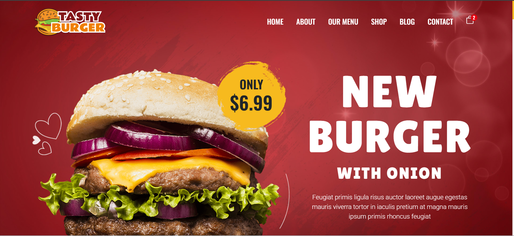
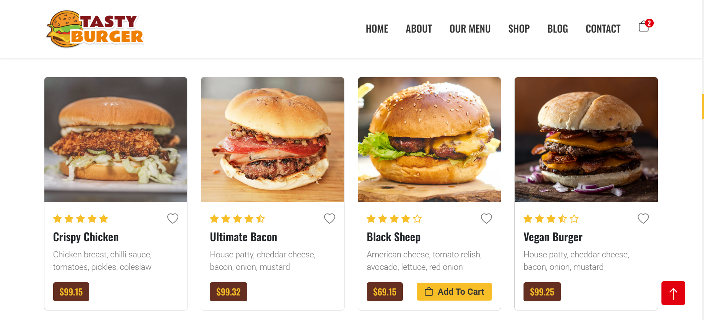
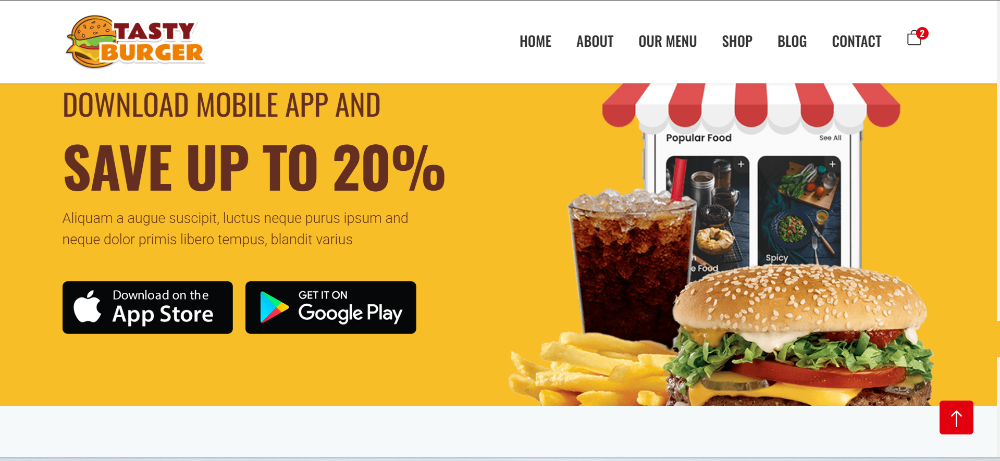
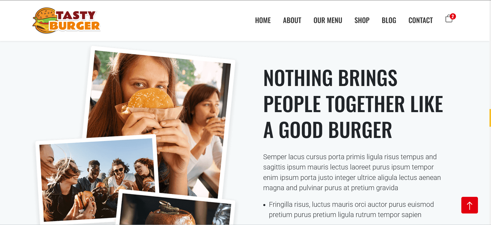
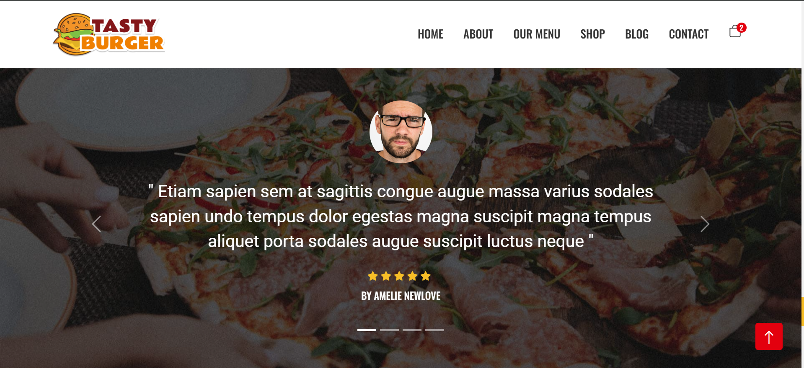
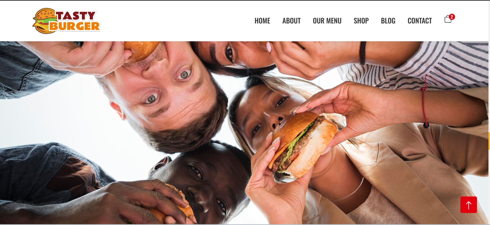
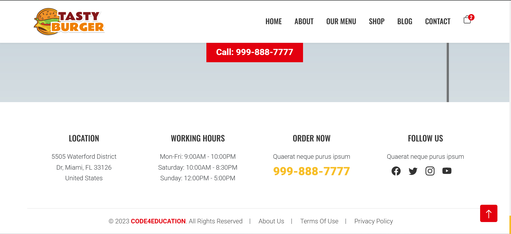

# 🍔 Food App (React)

A modern, responsive **Food Ordering Web Application** built with **React.js** and **Bootstrap**, designed to provide a smooth user experience for browsing food items, navigating between pages, and interacting with a clean, scalable UI.

---

## 🚀 Features

* ⚛️ Built with **React 18** for fast and dynamic UI rendering
* 🎨 **Bootstrap 5 & React-Bootstrap** for responsive and modern design
* 🧭 **React Router DOM** for smooth multi-page navigation
* 🧪 Integrated **Testing Library** for UI and user interaction testing
* 📱 Fully responsive layout (Mobile, Tablet, Desktop)
* ⚡ Optimized build using **React Scripts**

---

## 🛠️ Tech Stack

| Technology             | Description                 |
| ---------------------- | --------------------------- |
| React.js               | Frontend JavaScript Library |
| Bootstrap 5            | UI Styling Framework        |
| React-Bootstrap        | React UI Components         |
| React Router DOM       | Client-side Routing         |
| Jest & Testing Library | UI Testing                  |
| Node.js                | Runtime Environment         |
| NPM                    | Package Manager             |

---

## 📂 Project Structure

```bash
food-app/
├── public/          # Static files
├── src/             # Application source code
│   ├── components/ # Reusable UI components
│   ├── pages/      # Page-level components
│   ├── App.js      # Main App component
│   └── index.js    # Entry point
├── package.json    # Dependencies & scripts
└── README.md       # Project documentation
```

---

## ⚙️ Installation & Setup

Follow these steps to run the project locally:

### 1️⃣ Clone the Repository

```bash
git clone https://github.com/your-username/food-app.git
cd food-app
```

### 2️⃣ Install Dependencies

```bash
npm install
```

### 3️⃣ Start Development Server

```bash
npm start
```

The app will run on:

```
http://localhost:3000
```

---

## 🧪 Run Tests

To execute test cases:

```bash
npm test
```

---

## 📦 Build for Production

To create an optimized production build:

```bash
npm run build
```

The build folder will be generated and ready for deployment.

---

## 🌍 Deployment

You can deploy this project using platforms like:

* **Vercel**
* **Netlify**
* **Firebase Hosting**

Example (Vercel):

```bash
npm i -g vercel
vercel
```

---

## 📸 Screenshots

```md
## 📸 Screenshots









---

## 🧑‍💻 Author

**Tisa Patel**
Frontend Developer | React.js Enthusiast

* GitHub: [https://github.com/Tisapatel]
* LinkedIn: [https://www.linkedin.com/in/tisa-patel-384b80312/]

---

## 📜 License

This project is licensed under the **MIT License**. You are free to use, modify, and distribute this project.

---

## ⭐ Support

If you found this project helpful, please give it a ⭐ on GitHub and share it with others!

---

> "Building clean UI and scalable applications with React is not just coding, it's crafting experiences."
